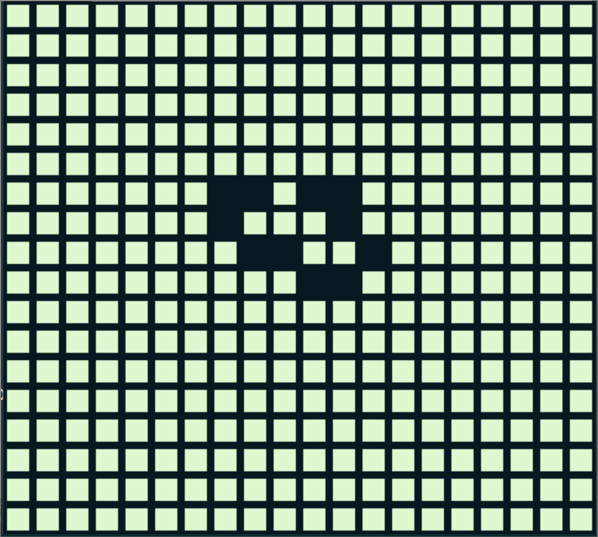

```
  _   _   _   _   _   _   _     _   _     _   _   _   _
 / \ / \ / \ / \ / \ / \ / \   / \ / \   / \ / \ / \ / \
( G | A | M | E | B | O | Y ) ( O | F ) ( L | I | F | E )
 \_/ \_/ \_/ \_/ \_/ \_/ \_/   \_/ \_/   \_/ \_/ \_/ \_/
 ```

 [Conway's Game of Life](https://en.wikipedia.org/wiki/Conway's_Game_of_Life) for the gameboy.
 Written at first using [GBDK](http://gbdk.sourceforge.net/) and a lot of cussing, now using the much faster [GBDK-N](https://github.com/andreasjhkarlsson/gbdk-n)

 The compiled version is available as [[gameboy_of_life.gb]]


 

## Building

If you cloned this without the submodule then run

```
git submodule init
git submodule update
```

Or if you haven't cloned it yet `git clone --recursive https://github.com/tahnok/gameboy_of_life/`

You'll need [sdcc](http://sdcc.sourceforge.net/), hopefully you can just `sudo apt-get install sdcc`

You need to build gbdk-n

```
cd gbdk-n
make
```
